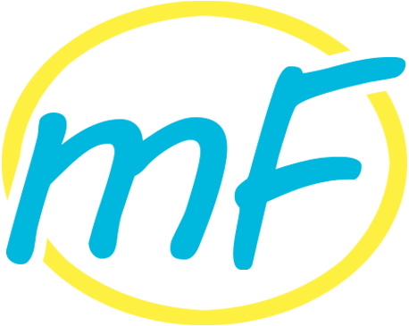
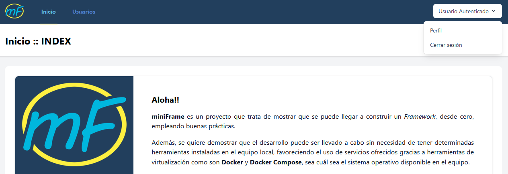
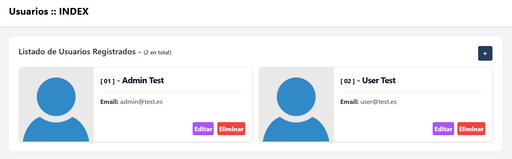
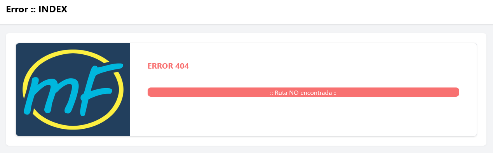
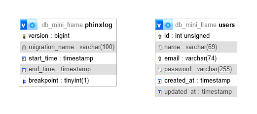

## Sobre miniFrame

miniFrame es un proyecto que trata de mostrar que se puede llegar a construir un Framework, desde cero, empleando buenas prácticas.

Además, se quiere demostrar que el desarrollo puede ser llevado a cabo sin necesidad de tener determinadas herramientas instaladas en el equipo local, favoreciendo el uso de servicios ofrecidos gracias a herramientas de virtualización como son Docker y Docker Compose, sea cuál sea el sistema operativo disponible en el equipo.

Tomando como inspiración inicial un framework como el de Laravel, se muestra como se pueden emplear herramientas empleadas en este tipo de grandes desarrollos dentro de uno personalizado como éste sin tener que reinventar la rueda.

Algunas herramientas serán instaladas como dependencias de proyecto, otras serán arrancadas por medio de servicios de contenedores.

Entre unas y otras, varias de las disponibles son las siguientes:

- NGiNX, como servidor web.
- PHP-FPM, procesos para PHP (v8.x).
- MySQL, como servidor web.
- Mailpit, como servidor de correo.

- PHP-DI, aplicando Inyección de Dependencias.
- Eloquent ORM, conectando con base de datos.
- FastRoute, sistema de rutas.
- Phinx, migraciones y seeders.

Partiendo de este punto de partida, se puede llegar a agrandar el desarrollo en la medida de lo que sea necesario para el proyecto a implementar ... hasta el infinito.

### Modelo de Datos

